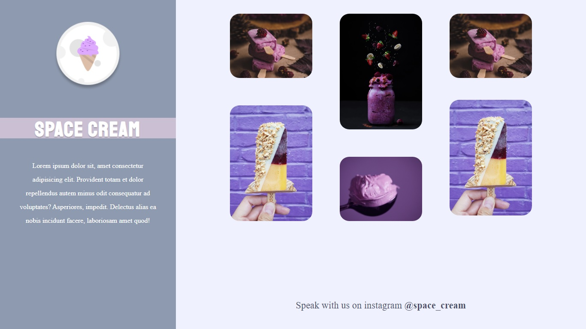

# Grid-Animations

Stage03 Challenge that is part of Rocketseat's Explorer Program  

The idea now is to create Space Cream in the Desktop version! 🚀  

Pay attention to the content that was taught in class. So, in this challenge, remember to use:  

- Grid;
- Animations and transitions, as seen in class;
- Medium queries.

## Screenshots

[🔗 Click here to access the Project](https://fabiovascao.github.io/Grid-Animations/)  
[🔗 Click here to access Figma](https://www.figma.com/file/Pe7uutrNAEaUnub53wSKHU/Stage-03-Grid-com-anima%C3%A7%C3%B5es-Copy?fuid=1151137169943796805)

## 🛠 Technologies

- HTML5
- CSS3
- Git e Github

## Author

- [@FabioVascão](https://www.github.com/fabiovascao)
 
